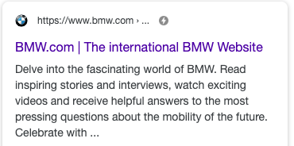

# AMP 그게 뭐야?

최근 진행한 프로젝트에서 기존 메인페이지를 AMP버전으로 만들어볼 기회가 생겼습니다.
AMP를 실제로 제작해보면서 느낀 점을 공유해보고자 합니다.

## AMP가 뭔데?
**AMP(Accelerated Mobile Pages)** 직역하면 모바일 가속화 페이지 입니다.
모바일 환경에서 빠른 속도로 페이지를 렌더링하여 제공합니다.
또한 검색 결과를 카드 뉴스형태로 보여주는 등 아름다운(?) 검색 결과 화면을 얻을 수 있습니다

## 작동원리
사용자가 **모바일환경에서 Google검색엔진을 통해** 검색을 하면 AMP페이지가 제공됩니다.
제공되는 페이지는 **Google AMP Cache**시스템을 통해 크롤링된 AMP페이지가 노출됩니다.

먼저 AMP페이지 제작 시 2가지 케이스로 나눌 수 있는데
1. 기존 페이지가 존재하고 별도의 AMP전용 페이지를 제작하는 경우
2. AMP페이지와 기존 페이지를 통합하여 사용하는 경우

2번의 경우는 그냥 프로젝트 자체를 AMP프로젝트로 진행하면 되지만,
1번과 같이 원본 페이지가 존재하고 별도 AMP페이지가 존재한다면 아래와 같이 서로의 연결고리~~(너와 나의)~~를 만들어 주어야 합니다.

자세한 사항은 [요기](https://amp.dev/documentation/guides-and-tutorials/start/create/prepare_for_discovery/?format=websites)에서 확인하실 수 있습니다.

고생해서 만든 AMP페이지는 아래와 같이 보여지게 됩니다.

모바일에서 Google을 통해 사이트를 검색하면 아래와 같이 노출됩니다.

 

위와 같이 AMP페이지는 사이트 주소 옆에 번개 모양이 있습니다.
위 링크를 눌러보면

 

BMW.COM이 아닌 google에서 해당 페이지를 제공하고 있습니다. 
이게 위에서 언급한 **Google AMP Cache**시스템입니다.
이와 같은 형태로 제공된다면 방문자 추적등 analytics사용에 대한 문제가 생기는데,
이는 `<amp-analytics>`컴포넌트로 해결할 수 있습니다.

## 사용하는 기술
사실 AMP프로젝트에서 사용하는 기술은 기존 최적화 기술들을 모아논 방법론이라고 생각해도 될 것 같습니다.
여러 가지 최적화 기법이 사용되는데, AMP전용태그의 사용을 제외하면 기존 사이트 제작시에도 사용할 수 있는 방법들 입니다.
* 외부 JS 제한
* CSS파일의 크기 제한(50byte)
* AMP 전용태그 사용

### 외부 JS 제한
AMP에서는 외부 JS의 로드를 제한합니다.
> `<amp-script>`태그로 외부 js를 로드하는 방법을 제공하지만 현재 기준(19/07/16) 실험적 기능으로 실제 프로덕션 레벨에서의 사용은 권장하고 있지 않습니다

결국 외부 JS를 제한하니 http요청이 줄어들어 페이지 로드시간이 단축되는 것은 당연합니다.
AMP로 만들고자 하는 페이지의 구성이 AMP에서 제공하는 컴포넌트들로 커버가 가능한 상황이라면 문제될 것이 없으나 외부 라이브러리가 필수적이라면 AMP도입을 조금 고민해봐야되지 않을까 싶습니다.

### CSS파일 크기 제한
AMP페이지의 CSS작성방식은 외부 CSS를 사용하지 않습니다.
따라서 내부에서 `<style amp-custom>`태그로 정의하여 사용하며, 한개의 태그만 사용가능하고 크기는 50byte로 제한됩니다.

### AMP 전용태그 사용
우리가 기존에 작성하던 html태그 중 AMP에서는 제한되는 것들이 있습니다.
이미지 태그 작성시에는 `<amp-img>`로 작성하고, 이미지 중에서도 gif를 사용한 애니메이션 이미지의 경우에는 `<amp-anim>`를 사용하여 작성합니다.
그 외에도 비디오태그도 `<amp-video>`를 사용하는 등 숙지하고 시작해야할 것들이 있습니다.

## 그래서 어떻게 만들어?
위에서 언급한 [규칙](https://amp.dev/documentation/guides-and-tutorials/start/create/basic_markup/?format=websites)대로 최초 HTML을 만들고 AMP에서 제공하는 컴포넌트들을 사용하여 제작하게 됩니다.
컴포넌트 사용 시 해당 컴포넌트에 맞는 JS를 import하여 사용하게됩니다
carousel 컴포넌트를 삽입하려면
``
와 같이 비동기방식으로 컴포넌트를 import하고 사용하면됩니다.

[AMP Components](https://amp.dev/documentation/components/)에서 다양한 컴포넌트의 데모와 작성 방식을 확인할 수 있습니다.

### 주의사항
AMP페이지에서 이미지 삽입 시 기본적으로 이미지의 넓이, 높이를 지정해주고 사용해야 합니다.
미리 크기를 지정하여 브라우저 reflow를 최소화하려는데 목적이 있습니다.
`<amp-img width=400 height=500 src="./sample.jpg">`와 같은 형태가 일반적이고
제공하려는 디자인에 따라 [layout속성](https://amp.dev/ko/documentation/examples/style-layout/how_to_support_images_with_unknown_dimensions/?format=websites)을 변경하여 사용할 수 있습니다.

## 만들어보니 어땠어?
먼저 결론을 말씀드리면 페이지 구성이 AMP컴포넌트로 커버가 가능하다면 추천하겠으나 그 외 라이브러리라던지 custom이 많은 페이지의 경우에는 추천드리지 않습니다.

물론 AMP컴포넌트를 사용하여 제작하면 편하게 구성 요소를 만들 수 는 있으나 사용자 script가 제한되다 보니 커스텀이 제한될 수 밖에 없습니다.

그리고 AMP컴포넌트로만 사용해서 완성된 페이지들을 보면 저 정도의 페이지 구성이면(아무래도 AMP컴포넌트로만 제작하니 제한이 있는 구성) 기존의 최적화 방법과 결합하여 사용하면 충분히 나쁘지 않은 사용자 경험을 제공할 수 있을 것 같은데 굳이 AMP를 사용해야할까 라는 의문도 들었습니다.

그래서 제 생각에는 기사형태의 뉴스, 매거진 페이지에는 적합할 수 있으나 그 외의 다이나믹한 요소가 있는 페이지에는 다소 부적절하지 않을까 하는 결론입니다.

## END..
좋으나 나쁘나 신기술을 사용해본 것은 좋은 경험임에는 틀림없는 것 같습니다.
물론 AMP에 대해 많은 것을 알지 못한 상태여서 이런 결론에 도달했을 수도 있을 것 같습니다.

좀 더 재밌게 글을 쓰고 싶었는데 정보 전달을 하다보니 딱딱한 글이 된 것 같아 아쉽네요ㅠㅠ
다음에는 글쓰기 연습을 해서 좀 더 재밌는 글로 뵙겠습니다:)